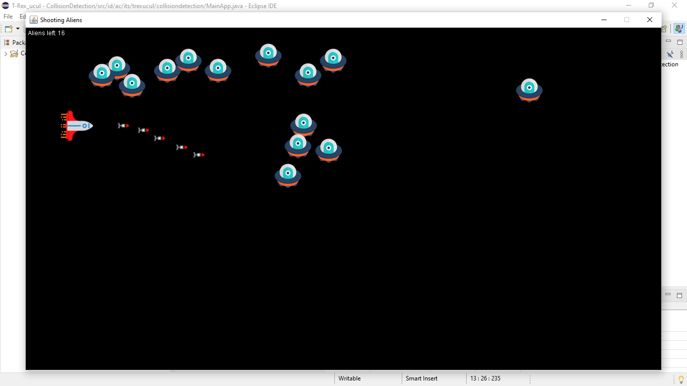
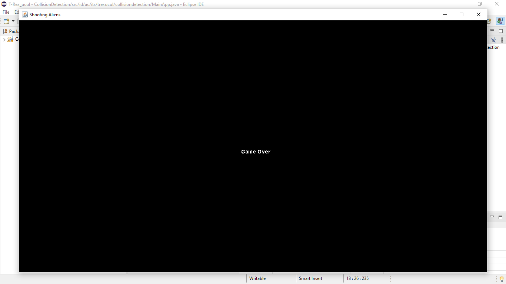
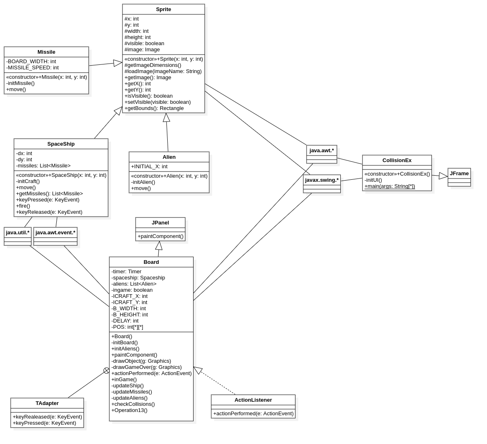

# ☕️ Collision Detection
****
***Project ini merupakan tugas mingguan dari Kelas Pemrograman Berbasis Objek Kelas E.*** Kode program dari project ini berdasarkan apa yang ada pada <http://zetcode.com/javagames/collision/> dengan beberapa pengembangan. Berikut sedikit penjelasan terkait project ini:
****
## Daftar Kelas
1. Alien
2. Board
3. Missile
4. SpaceShip
5. Sprite
6. MainApp
****
## Penjelasan Kelas

### Alien
***Sebuah kelas yang menurunkan kelas `Sprite`***, memiliki fungsi sebagai kelas dari objek alien dalam permainan.  
  
Daftar atribut:
- `INITIAL_X`: atribut `final` untuk menentukan posisi default setiap alien ketika melewati frame paling kiri.  
  
Daftar Fungsi:
1. `Alien` (Konstruktor): sebuah fungsi untuk menginisialisasi posisi dari setiap alien.
2. `initAlien`: mendapatkan gambar alien yang ada pada resource.
3. `move`: fungsi untuk mnggerakkan objek alien.

### Board
***Sebuah kelas yang menurunkan kelas `JPanel` dan mengimplementasikan interface `ActionListener`***, memiliki fungsi sebagai kelas dari papan permainan.  
  
Daftar atribut:
- `timer`: atribut untuk menghitung waktu berjalannya permainan.
- `spaceShip`: atribut pesawat dari permainan.
- `DELAY`: menentukan delay dari atribut timer.
- `ICRAFT_X`: posisi dari pesawat pada koordinat-X.
- `ICRAFT_Y`: posisi dari pesawat pada koordinat-Y.
- `aliens`: sebuah list yang menunjukkan daftar/banyak dari objek alien yang akan dibuat.
- `ingame`: atribut boolean untuk menentukan status permainan apakah masih berlangsung atau sudah selesai.
- `B_WIDTH`: lebar dari frame.
- `B_HEIGHT`: tinggi dari frame.
- `pos`: atribut berupa array 2 dimensi yang menyimpan koordinat awal dari alien.  
  
Daftar Fungsi:
1. `Board` (Konstruktor): sebuah fungsi yang memanggil fungsi `initBoard`.
2. `initBoard`: menginisialisasi papan permainan yang akan digunakan, dalam hal ini penambahan adapter untuk (input) kunci `TAdapter`, pengaturan warna background, inisialisasi status permainan, ukuran, pesawat beserta posisinya, pemanggilan fungsi `initAliens`, serta memulai penghitungan waktu.
3. `initAliens`: fungsi untuk menggerakkan objek alien
4. `paintComponent`: fungsi meng-*override* fungsi dari kelas induknya untuk menggambarkan objek-objek yang dibutuhkan pada permainan ini ke dalam frame/papan permainan berdasar pada status permainan.
5. `drawObjects`: fungsi yang dipanggil oleh fungsi `paintComponent` untuk menggambarkan objek-objek permainan ketika status permainan sedang berlangsung. Mulai dari objek pesawat, misil, dan alien, lalu menambahkan keterangan alien yang tersisa.
6. `drawGameOver`: fungsi yang dipanggil oleh fungsi `paintComponent` untuk menggambarkan sebuah string bertuliskan "Game Over" ketika status permainan telah berakhir.
7. `actionPerformed`: fungsi meng-*override* fungsi dari kelas induknya untuk melakukan pemanggilan fungsi lain yang berfungsi untuk menjalankan proses permainan. Berikut adalah fungsi yang dipanggil:
    - `inGame`: pemeriksa status permainan.
    - `updateShip`: fungsi yang akan memanggil fungsi `move` pada objek `spaceShip` berdasar pada visibilitas dari pesawat.
    - `updateMissiles`: fungsi ini akan mengambil objek misil dari pesawat kemudian ditentukan apakah misil masih didalam frame, jika iya maka akan digerakkan dengan memanggil fungsi `move` pada objek `missile`, jika tidak maka akan dihapus dari frame dengan memanggil fungsi `remove`-nya.
    - `updateAliens`: fungsi ini akan memanggil fungsi `move`/`remove` pada objek `aliens` berdasar pada visibilitasnya yang ditentukan dari tabrakannya dengan misil.
    - `checkCollisions`: fungsi ini akan memeriksa tabrakan antara pesawat dengan alien dan alien dengan misil. Jika terjadi tabrakan, maka akan memengaruhi status visibilitas dari masing-masing obhek dan status permainan.
    
Kelas tambahan: Jadi, di dalam kelas `Board` ini terdapat kelas `TAdapter` yang menurunkan kelas `KeyAdapter`. FUngsi kelas ini adalah untuk menangani tombol arah pada keyboard untuk menggerakkan pesawat dan tombol spasi untuk menembakkan misil. Di dalam kelas ini terdapat beberapa fungsi:
1. `keyReleased`.
2. `keyPressed`.

### Missile
***Sebuah kelas yang menurunkan kelas `Sprite`***, memiliki fungsi sebagai kelas dari objek misil dalam permainan.  
  
Daftar atribut:
- `BOARD_WIDTH`: lebar dari papan permainan.
- `MISSILE_SPEED`: kecepatan dari misil.  
  
Daftar Fungsi:
1. `Missile` (Konstruktor): sebuah fungsi untuk menginisialisasi posisi dari misil.
2. `initMissile`: mendapatkan gambar misil yang ada pada resource.
3. `move`: fungsi untuk menggerakkan objek misil.

### SpaceShip
***Sebuah kelas yang menurunkan kelas `Sprite`***, memiliki fungsi sebagai kelas dari objek pesawat dalam permainan.  
  
Daftar atribut:
- `dx`: atribut pengubah posisi pesawat pada koordinat-X.
- `dy`: atribut pengubah posisi pesawat pada koordinat-Y.
- `missiles`: atribut daftar yang berisi misil-misil yang akan ditembakkan.  
  
Daftar Fungsi:
1. `SpaceShip` (Konstruktor): sebuah fungsi untuk menginisialisasi posisi dari pesawat.
2. `initSpaceShip`: mendapatkan gambar pesawat yang ada pada resource serta inisialisasi atribut `missiles`.
3. `move`: fungsi untuk menggerakkan objek pesawat berdasarkan tombol yang ditekan user.
4. `getMissiles`: fungsi yang mengembalikan objek misil dari kelas `SpaceShip`.
5. `keyPressed`, `fire`, dan `keyReleased`: fungsi yang akan dipanggil kelas `TAdapter` (yang menangani tombol dari user) untuk menggerakkan pesawat dan menembakkan misil.

### Sprite
***Sebuah kelas induk dari kelas `Alien`, `Missile`, dan `SpaceShip`***, memiliki fungsi sebagai kelas yang menyimpan atribut dan fungsi pembangun objek dalam permainan.  
  
Daftar atribut:
- `x`: posisi objek pada koordinat-X.
- `y`: posisi objek pada koordinat-Y.
- `width`: lebar dari objek.
- `height`: tinggi dari objek.
- `visible`: visibilitas objek.
- `image`: gambar dari objek.  
  
Daftar Fungsi:
1. `Sprite` (Konstruktor): sebuah fungsi untuk menginisialisasi posisi dan visibilitas objek.
2. `loadImage`: mendapatkan gambar objek sesuai dengan direktori gambar.
3. `getImageDimensions`: menginisialisai lebar dan tinggi dari objek.
4. `getImage`: *getter* atribut `image`.
5. `getX`: *getter* atribut `x`.
6. `getY`: *getter* atribut `y`.
7. `isVisible`: *getter* atribut `visible`.
8. `setVisible`: *setter* atribut `visible`.
9. `getBounds`: mendapatkan garis batas setiap objek yang nantinya digunakan untuk memeriksa sebuah tabrakan.

### MainApp
***Sebuah kelas yang berisi fungsi utama aplikasi (`main`) dan menurunkan kelas `JFrame`***, memiliki fungsi untuk menjalankan program.  
  
Daftar Fungsi:
1. `MainApp` (Konstruktor): sebuah fungsi yang memanggil fungsi `initUI`.
2. `initUI`: menambahkan papan permainan pada frame sekaligus mengatur judul frame, lebar dan tinggi frame, serta beberapa pengaturan *default* lainnya.
3. `main`: fungsi untuk menjalankan program.

****
## Cara Kerja Program
Diatas sudah dijelaskan kegunaan dari setiap atribut dan fungsi yang ada dalam setiap kelas. Dari keseluruhan kode program, cara kerja program ini atau bisa disebut juga cara memainkan permainan ini adalah sebagai berikut:
1. Akan muncul sejumlah pesawat alien yang bergerak dari posisinya masing-masing ke kiri.
2. User memiliki pesawatnya sendiri yang dilengkapi dengan misil yang berada pada sisi kanan frame, berikut perintah yang dapat diberikan pada pesawat:
    - User dapat menggerakkan pesawatnya dengan tombol arah yang ada pada *keyboard* ke segala arah (atas, bawah, kanan, dan kiri).
    - Untuk menembakkan misil user dapat menekan tombol spasi.
3. Pesawat alien akan menghilang ketika dikenai oleh misil dengan begitu user berhasil mengalahkan satu alien.
4. Begitu juga pesawat user akan menghilang ketika pesawat alien menabraknya dengan begitu user dikalahkan oleh alien.
5. Permainan akan berakhir ketika:
    - Semua alien berhasil dikalahkan, dalam artian user berhasil menembak seluruh pesawat alien.
    - User dikalahkan alien, dalam artian pesawat user telah ditabrak oleh pesawat alien.

****
## Screenshot
Program:  
    - Ketika bermain  
    
    - Ketika selesai  
    
  
Class Diagram:  
