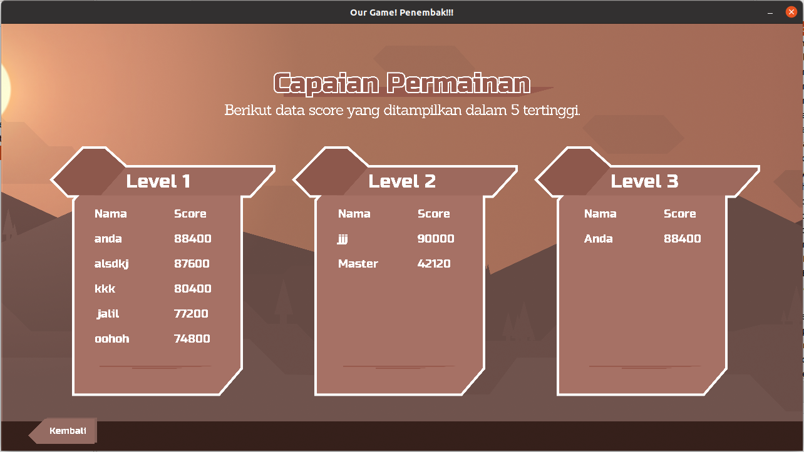
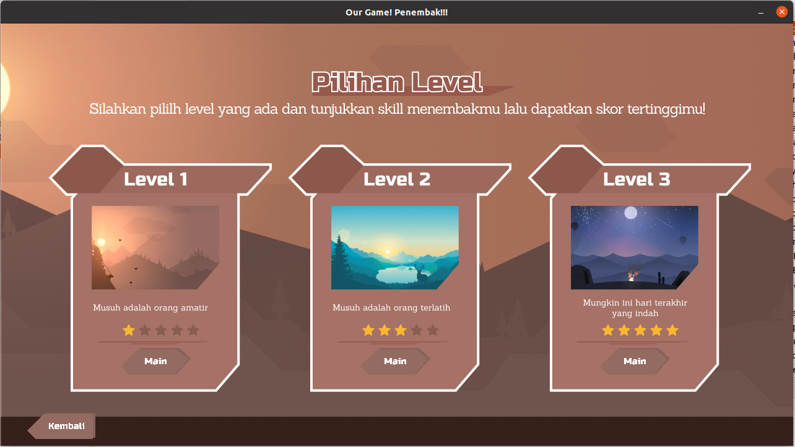
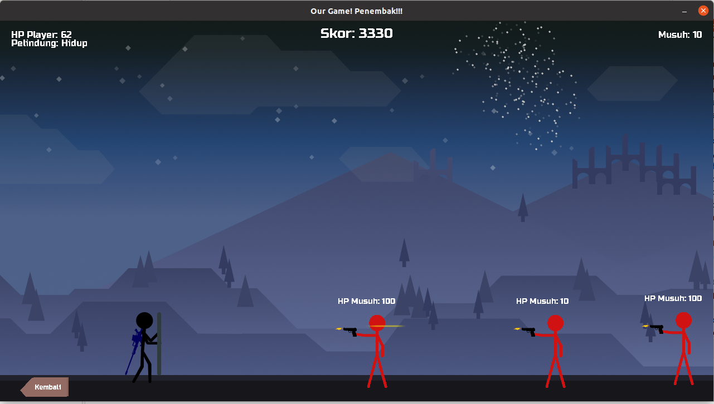

# ☕️ Final Project
    

🦖Nama : Allam Taju Sarof (05111940000053)
🦖username : Allam0053

🦖Nama: Muchamad Maroqi Abdul Jalil (05111940000143)
🦖username: maroqijalil

🦖Nama : Cahyadesthian Rizki Widigda (05111940000156)
🦖username : widigdacahya

****
### 💡Judul : Penembak 
### 💡Jenis : Permainan 
****

## Deskripsi Aplikasi 📌 
Penembak adalah sebuah permainan tembak-tembakan stickman yang terdiri dari beberapa level. 
Penembak memiliki beberapa fitur seperti beberapa screen untuk pemilihan level, menu, player yang memiliki shield saat tidak sedang bergerak, serta beberapa hal lainnya.

****  
📗 Class Diagram:  
  
**** 

📘 Penjelasan masing-masing kelas yang digunakan (Silahkan klik nama kelas untuk melihat penjelasannya):  
-->📁 components  
[`CommonButton.java`](PenjelasanKelas/Components/CommonButton.md)            
components/entities:    
[`Enemy.java`](PenjelasanKelas/Components/Entities/Enemy.md)           
[`Player.java`](PenjelasanKelas/Components/Entities/Player.md)          
[`Riffle.java`](PenjelasanKelas/Components/Entities/Riffle.md)          
[`Sniper.java`](PenjelasanKelas/Components/Entities/Sniper.md)              
components/object:              
[`Bullet.java`](PenjelasanKelas/Components/Objects/Bullet.md)              
[`EnemyBullet.java`](PenjelasanKelas/Components/Objects/EnemyBullet.md)                
[`Ground.java`](PenjelasanKelas/Components/Objects/Ground.md)            
[`PlayerBullet.java`](PenjelasanKelas/Components/Objects/PlayerBullet.md)              
    
-->📁 main  
[`Launcher.java`](PenjelasanKelas/Main/Launcher.md)               
[`Window.java`](PenjelasanKelas/Main/Window.md)                
main/pages:         
[`CharacterPage.java`](PenjelasanKelas/Main/Pages/CharacterPage.md)         
[`CreditPage.java`](PenjelasanKelas/Main/Pages/CreditPage.md)       
[`GameOverPage.java`](PenjelasanKelas/Main/Pages/GameOverPage.md)       
[`GamePage.java`](PenjelasanKelas/Main/Pages/GamePage.md)                
[`LevelPage.java`](PenjelasanKelas/Main/Pages/LevelPage.md)               
[`MenuPage.java`](PenjelasanKelas/Main/Pages/MenuPage.md)                    
[`PageState.java`](PenjelasanKelas/Main/Pages/PageState.md)                   
[`ScorePage.java`](PenjelasanKelas/Main/Pages/ScorePage.md)                       
[`SplashPage.java`](PenjelasanKelas/Main/Pages/SplashPage.md)     
[`VictoryPage.java`](PenjelasanKelas/Main/Pages/VictoryPage.md)                         

-->📁 model                 
model/data:             
[`Score.java`](PenjelasanKelas/Model/Data/Score.md)               
[`ScoreComparator.java`](PenjelasanKelas/Model/Data/ScoreComparator.md)                 
[`ScoreSerialIO.java`](PenjelasanKelas/Model/Data/ScoreSerialIO.md)                   
model/gfx:                  
[`Assets.java`](PenjelasanKelas/Model/Gfx/Assets.md)                      
[`Text.java`](PenjelasanKelas/Model/Gfx/Text.md)                        
model/id:                           
[`SelectedGamePage.java`](PenjelasanKelas/Model/Id/SelectedGamePage.md)                    

-->📁 utils
utils/handler:                          
[`KeyboardHandler.java`](PenjelasanKelas/handler/KeyboardHandler.md)                       
[`MouseHandler.java`](PenjelasanKelas/handler/MouseHandler.md)                        
utils/helper:               
[`Animation.java`](PenjelasanKelas/helper/Animation.md)                           
[`AnimationFire.java`](PenjelasanKelas/helper/AnimationFire.md)                           
[`Camera.java`](PenjelasanKelas/helper/Camera.md)                          
[`FontLoader.java`](PenjelasanKelas/helper/FontLoader.md)                      
[`ImageLoader.java`](PenjelasanKelas/helper/ImageLoader.md)                         
[`SecondsTimer.java`](PenjelasanKelas/helper/SecondsTimer.md)                            
utils/helper/io:                    
[`ReadIO.java`](PenjelasanKelas/IO/ReadIO.md)                          
[`ReadSerial.java`](PenjelasanKelas/IO/ReadSerial.md)                              
[`WriteIO.java`](PenjelasanKelas/IO/WriteIO.md)                                 
[`WriteSerial.java`](PenjelasanKelas/IO/WriteSerial.md)                                 
utils/listener:                         
[`BulletListener.java`](PenjelasanKelas/Listener/BulletListener.md)                       
[`ClickListener.java`](PenjelasanKelas/Listener/ClickListener.md)                       
[`KeyTypedListener.java`](PenjelasanKelas/Listener/KeyTypedListener.md)                            

## Objek Game
Berikut objek atau componen permainan yang ada dalam proyek ini:
### Player 👦🏻
Player merupakan pemain yang dikendalikan oleh pemain untuk menembak musuh yang ada. 
Pemain menggunakan player untuk membunuh semua enemy yang ada di setiap level untuk mendapat score.
Player memiliki health yang berkurang saat ditembaki oleh enemy, saat health player habis maka akan muncul layar Game Over.
Player juga memiliki shield yang melindungi dirinya dari peluru Enemy saat Player berdiam diri.   
Untuk menggerakkan player, pemain dapat menggunakan:   
- Tombol arah atas untuk melompat.   
- Tombol arah kanan untuk bergerkan maju.     
- Tombol arah kiri untuk bergerak mundur.      
- Tombol spasi untuk menembakkan peluru.      
**Tambahan**: Ketika tombol ditekan pelindung akan dalam keadaan terbuka (mati).      

Pemain diberikan pilihan untuk menentukan karakter mana yang ingin dipakai ketika bermain.
Setiap karakter memiliki variasi health, damage, dan interval tembak yang berbeda.
Terdapat 3 pilihan karakter yang dapat dipilih pemain.              

### Enemy 👩🏻
Musuh player yang menembak player dengan tujuan untuk membunuh player.
Enemy memiliki health yang berkurang saat terkenap peluru tembakan Player,
saat health Enemy habis, maka Enemy akan mati dan hilang dari layar.
Enemy akan bergerakn melompat-lompat untuk mempersulit player dalam bergerak.
Pada setiap level memiliki perbedaan damage dari tembakan enemy dan selang enemy menembakkan pelurunya.
Semakin tinggi level, maka damage akan semakin tinggi dan interval menembakknya semakin cepat.

## Layar Game
Berikut layar-layar atau halaman-halaman yang ada dalam permainan ini:
### Splash Screen
📄Screen awal yang menunjukkan title game sebelum ke screen menu.       
  

### Menu Screen
📄Screen yang memiliki beberapa pilihan tombol seperti tombol "Main",
untuk memulai bermain dengan memilih level dan karakter sebelumnya.
Lalu ada tombol "Skor" untuk melihat capaian skor permainan.
Dan tombol "Credits" untuk menuju ke Credit Screen.     
  

### Score Screen
📄Screen yang menampilkan score dari Player yang berhasil mengalahkan Enemy.
Skor akan ditampilkan dalam 5 tertinggi dan disusun per levelnya.     
  

### Credit Screen
📄Screen yang menampilkan data diri kelompok Trex-ucul.     
  

### Level Screen
📄Screen untuk memilih map pertandingan yang akan dilalui oleh Player melawan Enemy.
Selain itu juga memilih tingkat kesulitan game yang akan dimainkan.        
  
  
### Character Screen
📄Screen untuk memilih karakter penembak untuk melawan Enemy.        
  

### Game Screen
📄Screen tempat dimana Player dan Enemy saling menembak atau bertempur.
Terdapat 3 jenis map yang ada dalam permainan perbedaan map ini ditempatkan pada setiap level yang berbeda.      
- Map level 1.   
     
- Map level 2.   
     
- Map level 3.   
  

### Victory Screen
📄Screen yang muncul saat player berhasil mengalahkan enemy.
Pada screen ini pemain akan diminta untuk memeasukkan nama sebagai rekam capaian dari permainan.
Data skor dari Game Screen atau permainan saat itu juga akan ditampilkan disini.     
    

### Game Over Screen
📄Screen yang muncul saat Player kalah atau healthnya habis karena tertembak oleh Enemy.     
  

 
## Referensi
  📚 <a href="https://www.figma.com/file/0ei6x3VdT1XXTR5jnzUXpX/Untitled?node-id=0%3A1">Figma (Pembuatan Asset)</a>   
  📚 <a href="https://github.com/JoshuaHernandezMartinez/Sokoban">Code and Paging Structure: Sokoban Game</a>   
  📚 Code Architecture: Mengkombinasikan antara MVP (Model View Presenter) dari Android Dev
  dan arsitektur Java Game Programming pada umumnya.         
  📚 Logic and Game Mechanics -> Neon Game: Java Platform Game Programming by RealTutsGML on <a href="https://www.youtube.com/playlist?list=PLWms45O3n--54U-22GDqKMRGlXROOZtMx">YouTube</a>         
  📚 Tutorial <a href="http://zetcode.com/javagames/collision/">Zetcode</a>         
  📚 <a href="https://play.google.com/store/apps/details?id=com.noodlecake.altosadventure&hl=in&gl=US">UI reference</a>         
  📚 dan dokumentasi lainnya dari Oracle dan penugasan harian.  
