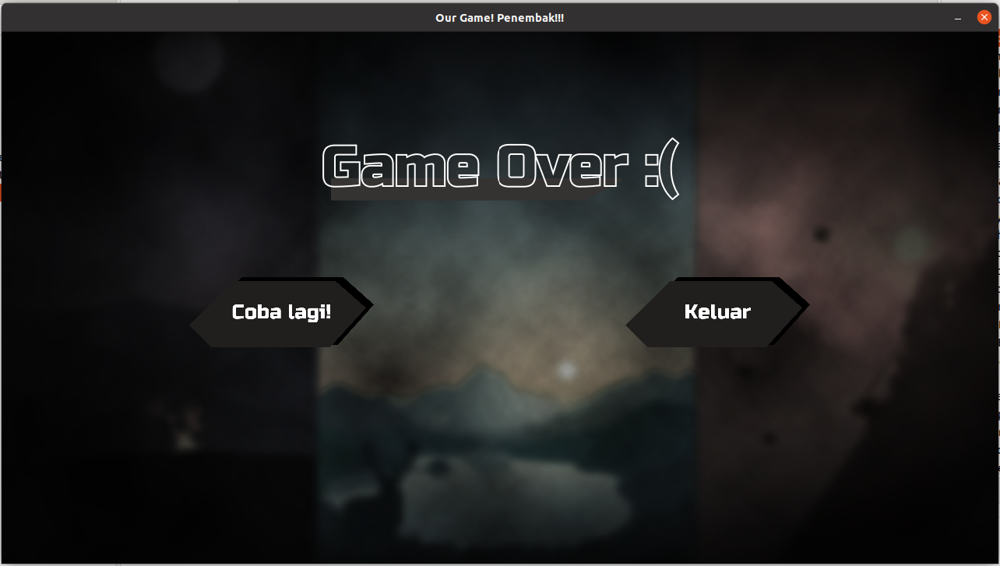

# ☕️ Final Project
    

🦖Nama : Allam Taju Sarof (05111940000053)
🦖username : Allam0053

🦖Nama: Muchamad Maroqi Abdul Jalil (05111940000143)
🦖username: maroqijalil

🦖Nama : Cahyadesthian Rizki Widigda (05111940000156)
🦖username : widigdacahya

****
### 💡Judul : Penembak 
### 💡Jenis : Permainan 
****

## Deskripsi Aplikasi 📌 
Penembak adalah sebuah permainan tembak-tembakan stickman yang terdiri dari bebera level. 
Penembak memiliki beberapa fitur seperti beberapa screen untuk pemilihan level, menu, player yang memiliki shield saat tidak sedang bergerak, serta beberapa hal lainnya.

****  
📗 Class Diagram:  
  
**** 

📘 Penjelasan masing-masing kelas yang digunakan:
-->📁 components
`CommonButton.java`: class untuk            
components/entities:    
`Enemy.java`: class untuk           
`Player.java`: class untuk          
`Riffle.java`: class untuk          
`Sniper.java`: class untuk              
components/object:              
`Bullet.java`: class untuk              
`EnemyBullet.java`: class untuk                
`Ground.java`: digunakan untuk memuat gambar komponen tanah dan bounds yang menjadi tempat player dan enemy berpijak            
`PlayerBullet.java`: class untuk              
    
-->📁 main  
`Launcher.java`: class untuk               
`Window.java`: class untuk                
main/pages:         
`CharacterPage.java`: class untuk         
`CreditPage.java`: digunakan untuk menampilkan gambar anggota kelompok dan biodata dan tombol untuk kembali ke menu utama       
`GameOverPage.java`: class screen gameover page menyediakan tombol untuk keluar game atau mencoba kembali       
`GamePage.java`: class untuk                
`LevelPage.java`: class untuk               
`MenuPage.java`: class untuk                    
`PageState.java`: class untuk                   
`ScorePage.java`: class untuk                       
`SplashPage.java`: class digunakan untuk screen awal yang menunjukkan identitas game selama beberapa detik dan mengarahkan pemain ke menu utama     
`VictoryPage.java`: class untuk                         

-->📁 model                 
model/data:             
`Score.java`: class untuk               
`ScoreComparator.java`: class untuk                 
`ScoreSerialIO.java`: class untuk                   
model/gfx:                  
`Assets.java`: class untuk                      
`Text.java`: class untuk                        
model/id:                           
`SelectedGamePage.java`: class untuk                    

-->📁 utils
utils/handler:                          
`KeyboardHandler.java`: class untuk                     
`MouseHandler.java`: class untuk                        
utils/helper:               
`Animation.java`: class untuk                           
`AnimationFire.java`: class untuk                           
`Camera.java`: class untuk                          
`FontLoader.java`: class untuk                      
`ImageLoader.java`: class untuk                         
`SecondsTimer.java`: class untuk                            
utils/helper/io:                    
`ReadIO.java`: class untuk                          
`ReadSerial.java`: class untuk                              
`WriteIO.java`: class untuk                                 
`WriteSerial.java`: class untuk                                 
utils/listener:                         
`BulletListener.java`: class untuk                  
`ClickListener.java`: class untuk                       
`KeyTypedListener.java`: class untuk                            

### Player 👦🏻
Player merupakan pemain yang dikendalikan oleh pemain untuk menembak musuh yang ada. 
Pemain menggunakan player untuk membunuh semua enemy yang ada di setiap level untuk mendapat score.
Player memiliki health yang berkurang saat ditembaki oleh enemy, saat health player habis maka akan muncul screen Game Over.
Player juga memiliki shield yang melindungi dirinya dari peluru Enemy saat Player berdiam diri.             
  

### Enemy 👩🏻
Musuh player yang menembak player dengan tujuan untuk membunuh player.
Enemy memiliki health yang berkurang saat terkenap peluru tembakan Player,
saat health Enemy habis, maka Enemy akan mati dan hilang dari screen.
  
### Splash Screen
📄Screen awal yang menunjukkan title game sebelum ke screen menu.       
  

### Menu Screen
📄Screen yang memiliki beberapa pilihan tombol seperti tombol "Main" untuk memilih level dan Credit untuk menuju ke Credits Screen.     
  

### Hall of Fame Screen
📄Screen yang menampilkan score dari Player yang berhasil mengalahkan Enemy.     
  

### Credit Screen
📄Screen yang menampilkan data diri kelompok Trex-ucul.     
  

### Level Screen
📄Screen untuk memilih map pertandingan yang akan dilalui oleh Player melawan Enemy.        
  
  
### Character Screen
📄Screen untuk memilih karakter penembak untuk melawan Enemy.        
  

### GamePage
📄Screen tempat dimana Player dan Enemy saling menembak.
Terdapat 3 jenis map yang ada dalam permainan.      
    

### Victory Screen
📄Screen yang muncul saat player berhasil mengalahkan enemy     
    

### Game Over Screen
📄Screen yang muncul saat Player kalah atau healthnya habis karena tertembak oleh Enemy     
  

 
### Referensi
  📚 <a href="https://www.figma.com/file/0ei6x3VdT1XXTR5jnzUXpX/Untitled?node-id=0%3A1">Figma (Pembuatan Asset)</a>   
  📚 <a href="https://github.com/JoshuaHernandezMartinez/Sokoban">Code Architecture: Sokoban Game</a>   
  📚 Logic--> Neon Game: Java Platform Game Programming by RealTutsGML on <a href="https://www.youtube.com/playlist?list=PLWms45O3n--54U-22GDqKMRGlXROOZtMx">YouTube</a>         
  📚 Tutorial <a href="http://zetcode.com/javagames/collision/">Zetcode</a>         
  📚 <a href="https://play.google.com/store/apps/details?id=com.noodlecake.altosadventure&hl=in&gl=US">UI reference</a>         
  📚 dan dokumentasi lainnya dari Oracle dan penugasan harian.  
