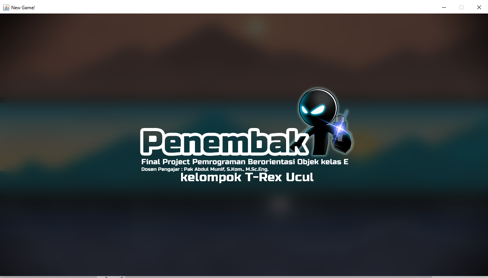
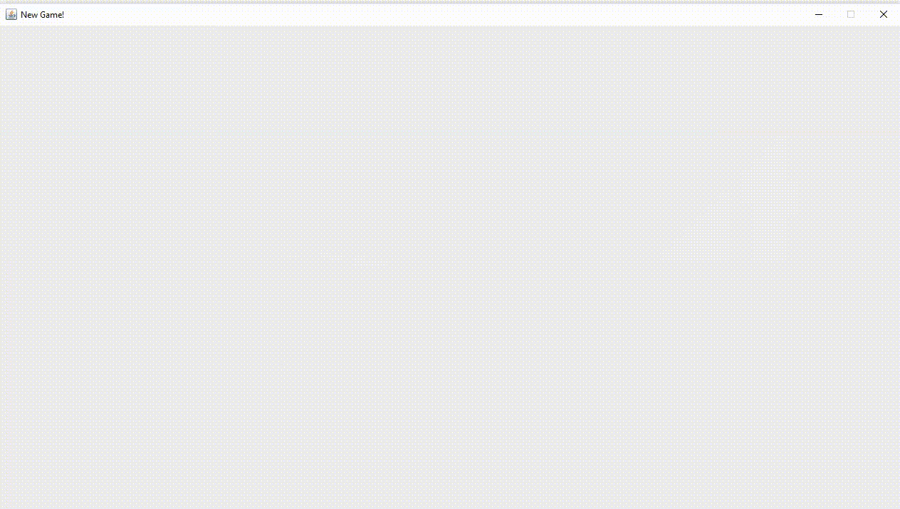
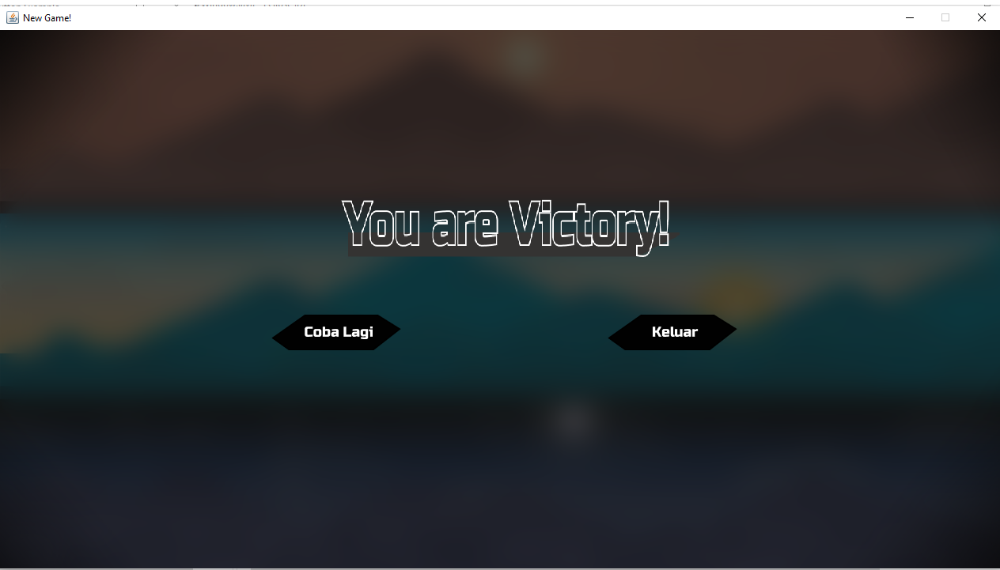
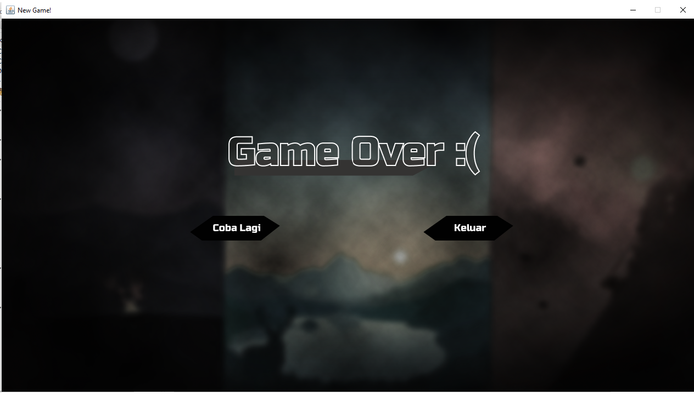
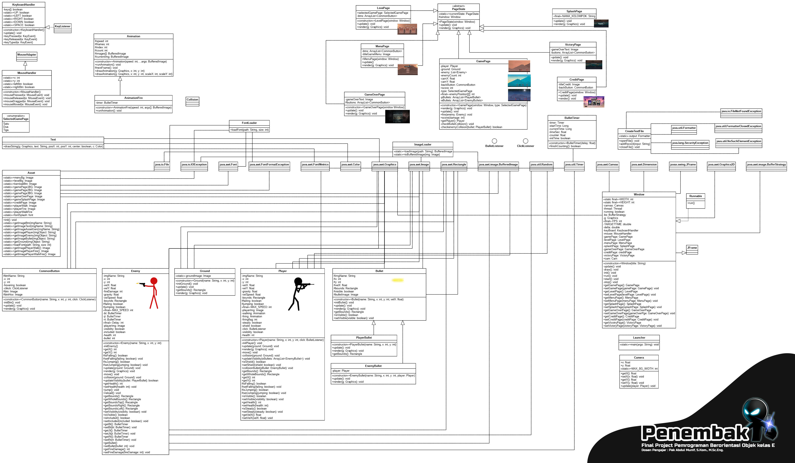

# ☕️ Final Project
****

<a href="https://youtu.be/hJ1MGWCdPKY">Video Saat Playing</a>   

****
🦖Nama : Allam Taju Sarof (05111940000053)
🦖username : Allam0053

🦖Nama: Muchamad Maroqi Abdul Jalil (05111940000143)
🦖username: maroqijalil

🦖Nama : Cahyadesthian Rizki Widigda (05111940000156)
🦖username : widigdacahya
****

****
### Judul Aplikasi : Penembak 
### Jenis : Game 
****
## Deskripsi Aplikasi 
Penembak adalah sebuah permainan tembak-tembakan stickman yang terdiri dari bebera level. 
Penembak memiliki beberapa fitur seperti beberapa screen untuk pemilihan level, menu, player yang memiliki shield saat tidak sedang bergerak, serta beberapa hal lainnya.

### Player
Player merupakan pemain yang dikendalikan oleh pemain untuk menembak musuh yang ada. 
Pemain menggunakan player untuk membunuh semua enemy yang ada di setiap level untuk mendapat score.
Player memiliki health yang berkurang saat ditembaki oleh enemy, saat health player habis maka akan muncul screen Game Over.
Player juga memiliki shield yang melindungi dirinya dari peluru Enemy saat Player berdiam diri.

### Enemy
Musuh player yang menembak player dengan tujuan untuk membunuh player.
Enemy memiliki health yang berkurang saat terkenap peluru tembakan Player,
saat health Enemy habis, maka Enemy akan mati dan hilang dari screen.
  
### Splash Screen
Screen awal yang menunjukkan title game sebelum ke screen menu.

### Menu Screen
Screen yang memiliki beberapa pilihan tombol seperti tombol "Main" untuk memilih level dan Credit untuk menuju ke Credits Screen.

### Credit Screen
Screen yang menampilkan data diri kelompok Trex-ucul

### Level Screen
Screen untuk memilih map pertandingan yang akan dilalui oleh Player melawan Enemy.

### GamePage
Screen tempat dimana Player dan Enemy saling menembak.
Terdapat 3 jenis map yang ada dalam permainan.

### Victory Screen
Screen yang muncul saat player berhasil mengalahkan enemy
    

### Game Over Screen
Screen yang muncul saat Player kalah atau healthnya habis karena tertembak oleh Enemy
  

****  
Class Diagram:  

****  
### Referensi
- Sokoban Game : 
- Neon Game : 
- Tile Game : 

