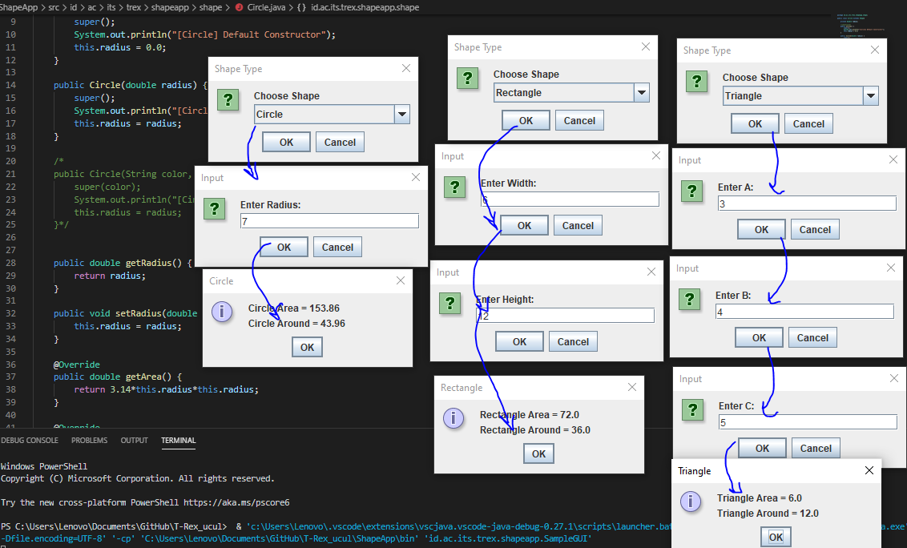
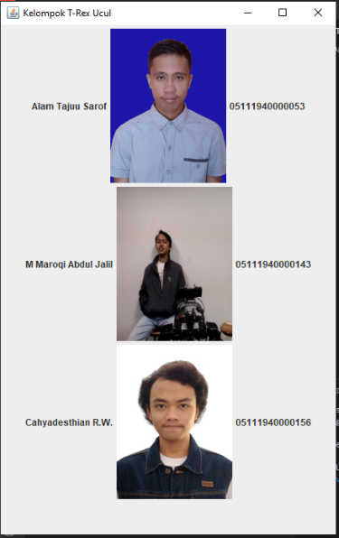
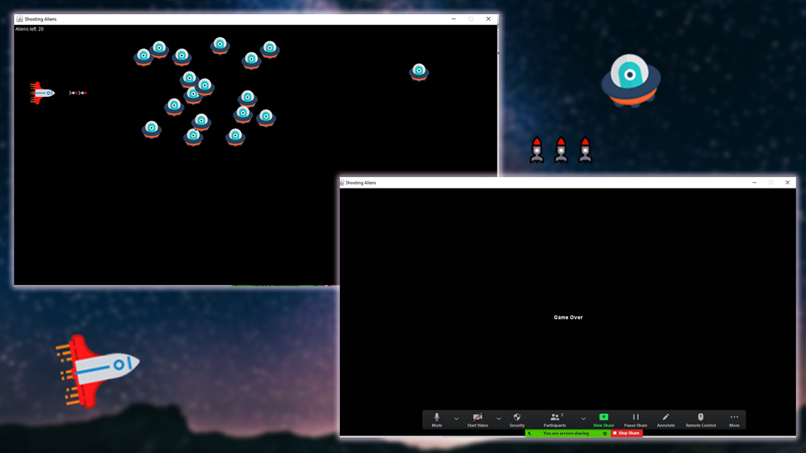
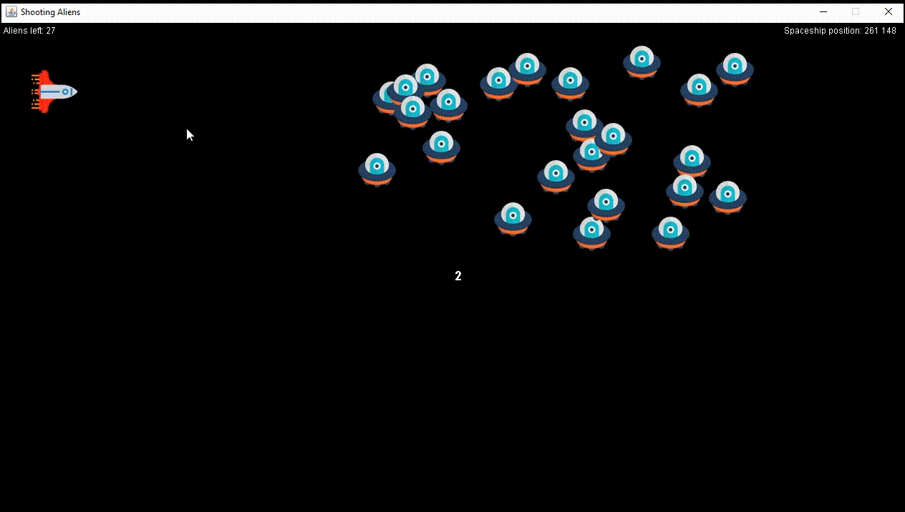

# T-Rex_ucul
Pemrograman Berorientasi Objek Kelas E  

📗project 1: ShapeApp     
📗project 2: DisplayApp             
📗project 3: Collision Detection                
📗project 4: Collision Detection with mouse                 
📗FINAL PROJECT : <a href="https://github.com/widigdacahya/T-Rex_ucul/tree/main/FinalProject">Final Projeck:Penembak</a>                  

### Anggota kelompok:  

🦖Nama : Allam Taju Sarof (05111940000053)    
🦖username : Allam0053

🦖Nama: Muchamad Maroqi Abdul Jalil (05111940000143)  
🦖username: maroqijalil

🦖Nama : Cahyadesthian Rizki Widigda (05111940000156)     
🦖username : widigdacahya

---------------------------------------
☕️Project 1:            

            
☕️Project 2:            
      

☕️Project 3:            
      

☕️Project 4:            
      

☕️FINAL PROJECT :       
      

